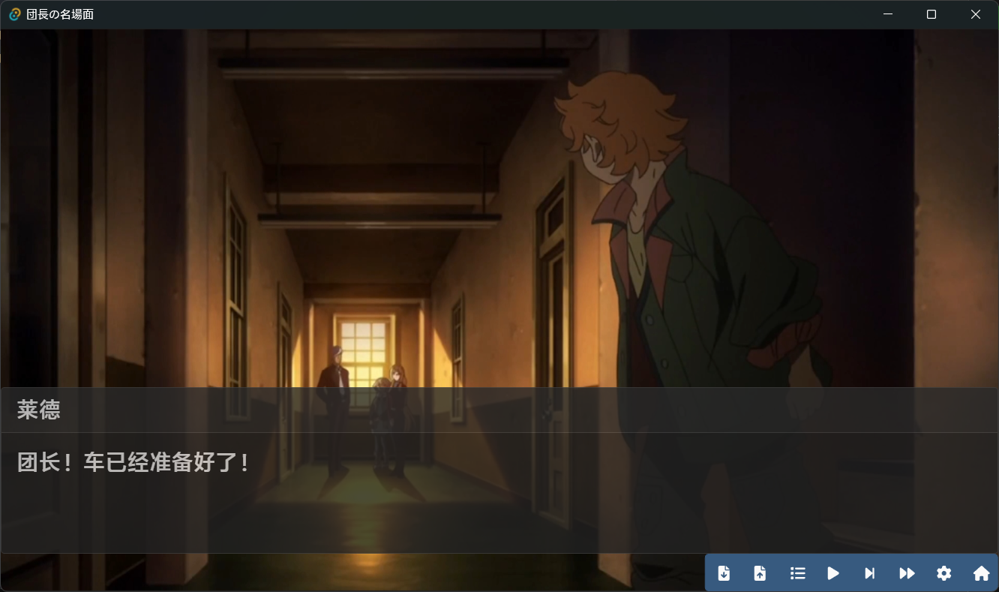

# GAL


[](https://strawberry-vs.visualstudio.com/gal/_build)

This is a project working-in-progress for OSPP 2022.

Gal is a voice novel engine which aims at 3 goals: simple, free, concentrate.

## Docs
See GalBook:
``` bash
$ make serve-book
```

Build API docs into `utils/target/doc`:
``` bash
$ make doc
```

## Screenshot

